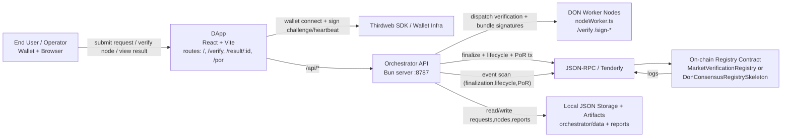
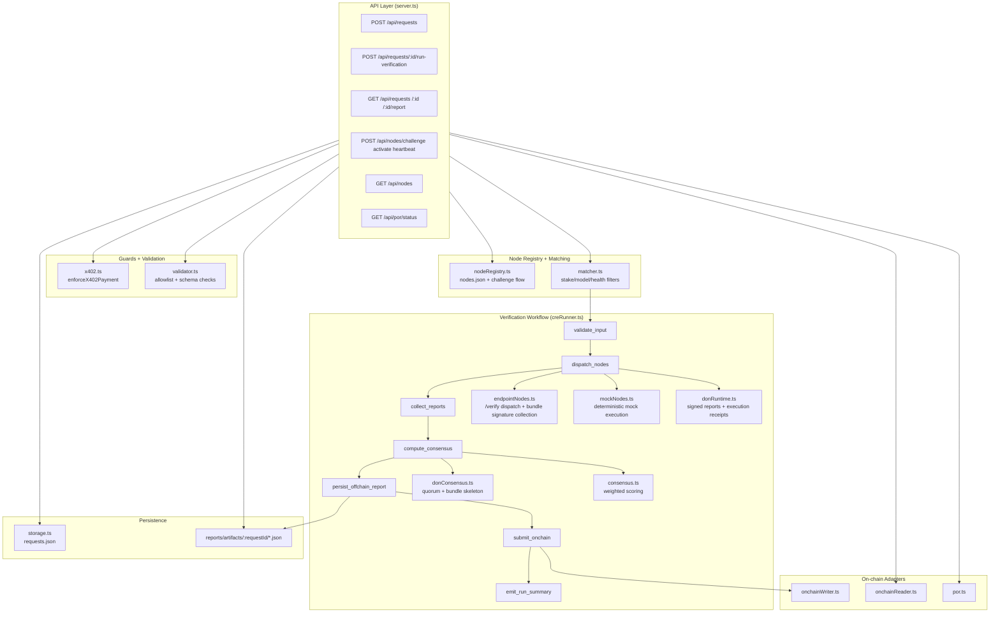
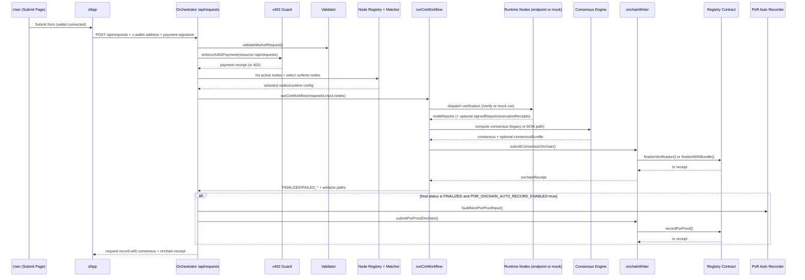
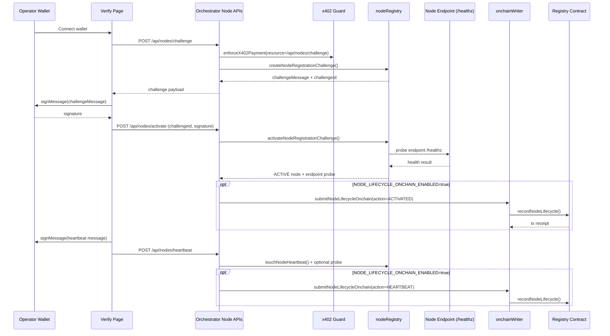
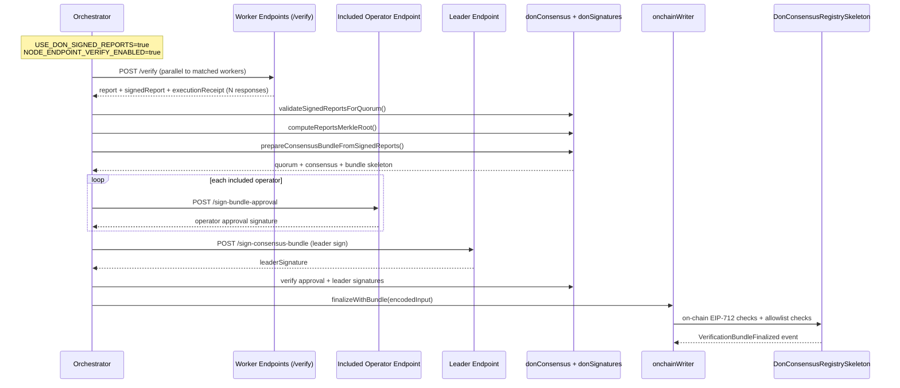
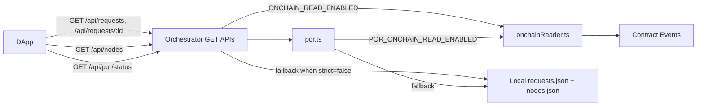
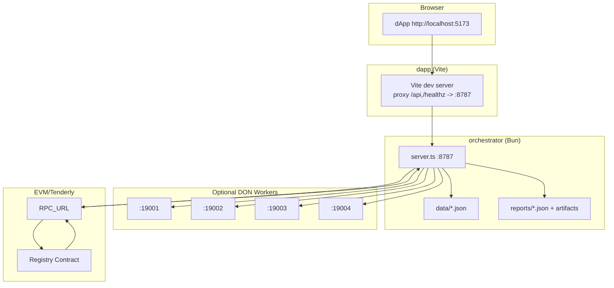

# CRE Prediction Market Demo - Architecture

This document maps the current architecture in this repository (`contracts`, `orchestrator`, `dapp`) with multiple diagrams.

## 1) System Context

## 2) Orchestrator Component View

## 3) Request Lifecycle (Auto Verification)

## 4) Node Operator Registration + Heartbeat

## 5) DON Distributed Consensus + Bundle Signing Path

## 6) Read Path for Result / Verify / PoR Pages

## 7) Local Dev Deployment Topology

## Runtime Mode Switches (Key Flags)

```mermaid
flowchart TB
    A["DON signed flow"]
    A1["USE_DON_SIGNED_REPORTS"]
    A2["NODE_ENDPOINT_VERIFY_ENABLED"]
    A3["NODE_ENDPOINT_REQUIRE_SIGNED_REPORTS"]
    A --> A1
    A --> A2
    A --> A3

    B["DON bundle finalize"]
    B1["USE_DON_BUNDLE_FINALIZE"]
    B2["DON_ENDPOINT_BUNDLE_SIGNING_ENABLED"]
    B --> B1
    B --> B2

    C["x402 gate"]
    C1["X402_ENABLED"]
    C2["X402_PRICE_*"]
    C --> C1
    C --> C2

    D["Node selection strictness"]
    D1["REQUIRE_REGISTERED_NODES"]
    D2["ALLOW_DEFAULT_NODES"]
    D3["MIN_NODE_STAKE"]
    D4["REQUIRE_HEALTHY_NODE_ENDPOINTS"]
    D --> D1
    D --> D2
    D --> D3
    D --> D4

    E["On-chain read behavior"]
    E1["ONCHAIN_READ_ENABLED"]
    E2["ONCHAIN_READ_STRICT"]
    E --> E1
    E --> E2

    F["PoR source + auto record"]
    F1["POR_ONCHAIN_READ_ENABLED"]
    F2["POR_ONCHAIN_AUTO_RECORD_ENABLED"]
    F --> F1
    F --> F2

    G["Mock vs real tx"]
    G1["USE_MOCK_ONCHAIN"]
    G --> G1
```

